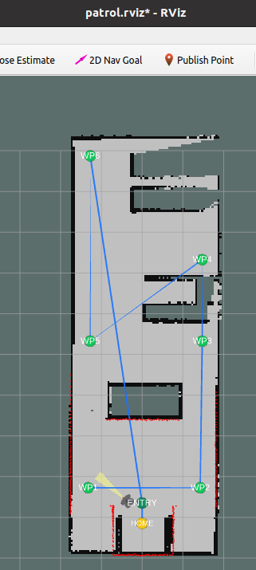
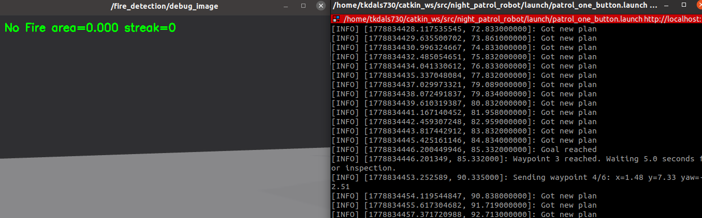
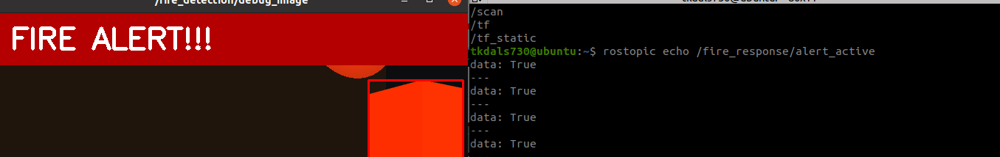

# Night Patrol Robot

Gazebo 시뮬레이션 환경에서 TurtleBot3 Waffle Pi를 사용해 야간 순찰 로봇을 구성하는 ROS Noetic 패키지입니다. 현재 프로젝트는 사무실 형태의 월드에서 SLAM 기반 맵 생성, frontier 기반 자동 탐색, 저장된 맵 기반 waypoint 순찰, 카메라 영상 기반 화재 감지를 함께 실행하는 것을 목표로 합니다.

## 주요 기능

- Gazebo 월드와 TurtleBot3 로봇 자동 실행
- `gmapping`을 이용한 SLAM 맵 생성
- frontier 기반 자동 탐색, 반복 실패 frontier 억제, 탐색 완료 신호 제공
- 탐색 완료 후 자동 맵 저장 및 home waypoint 복귀
- 저장된 맵, AMCL, `move_base`를 이용한 waypoint 순찰
- 순찰 한 바퀴 완료 후 home waypoint 복귀 옵션 제공
- 카메라 RGB 이미지에서 빨강/주황 계열을 감지하는 화재 감지 노드
- 화재 후보가 일정 시간 이상 보이면 순찰을 일시 정지하고, 추가 확인 후 `/patrol_alert`를 publish하는 대응 노드
- RViz 설정과 카메라 디버그 이미지 뷰어 실행 옵션 제공

## 패키지 구조

```text
night_patrol_robot/
├── config/                  # AMCL, costmap, move_base 설정
├── launch/                  # Gazebo, 순찰, 맵 저장 launch 파일
├── maps/                    # 저장된 patrol_map 출력 위치
├── rviz/                    # RViz 설정
├── scripts/                 # 탐색, 순찰, 화재 감지 ROS 노드
├── urdf/                    # 로봇 관련 xacro 파일
└── worlds/                  # Gazebo 사무실/테스트 월드
```

## 표준 실행 방법

이 프로젝트는 `launch/patrol_one_button.launch`를 기본 진입점으로 사용합니다. 기본값인 `mapping:=auto`는 저장된 맵이 없으면 맵을 생성하고, 맵이 있으면 저장 맵 기반 순찰을 실행합니다. 내부 실행은 `launch/patrol_runtime.launch`가 담당하므로, 기본 월드와 frontier 튜닝 값은 두 launch 파일이 같은 의미를 갖도록 맞춰 둡니다.

전체 운영/검증 흐름은 `docs/workflows.md`에 정리되어 있습니다.

### 빠른 시작

이미 저장된 기준 맵(`maps/patrol_map.yaml`)이 있는 상태에서 순찰, waypoint marker, 화재 감지 디버그 화면까지 바로 확인하려면 다음 명령을 사용합니다.

```bash
cd ~/catkin_ws
catkin_make
source devel/setup.bash
roslaunch night_patrol_robot patrol_one_button.launch mapping:=false
```

맵을 처음부터 다시 만들고 싶으면 기존 맵 파일을 따로 백업하거나 삭제한 뒤 기본 자동 모드를 실행하거나, `mapping:=true`로 맵핑 모드를 강제 실행합니다.

### 1. 빌드 및 환경 설정

```bash
cd ~/catkin_ws
catkin_make
source devel/setup.bash
```

### 2. 자동 모드 실행

맵 파일이 없으면 Gazebo, TurtleBot3, SLAM, `move_base`, frontier 탐색, 자동 맵 저장, 화재 감지를 함께 실행합니다. 이미 `maps/patrol_map.yaml`이 있으면 저장된 맵 기반 순찰 모드로 실행됩니다.

```bash
roslaunch night_patrol_robot patrol_one_button.launch
```

### 3. 맵 생성 모드 강제 실행

Gazebo, TurtleBot3, SLAM, `move_base`, frontier 탐색, 화재 감지를 함께 실행합니다.

```bash
roslaunch night_patrol_robot patrol_one_button.launch mapping:=true
```

화면이 너무 무거우면 RViz와 카메라 뷰어를 끄고 실행합니다.

```bash
roslaunch night_patrol_robot patrol_one_button.launch mapping:=true use_rviz:=false use_camera_viewer:=false
```

frontier 선택 기준을 조정하면서 실행할 수도 있습니다. `office_patrol_nov4.world` 기준 기본값은 정보량이 큰 frontier를 우선하고, 실패한 상단 끝 frontier가 반복될 때 탐색 완료로 빠질 수 있도록 조정되어 있습니다.

```bash
roslaunch night_patrol_robot patrol_one_button.launch mapping:=true frontier_area_blacklist_radius:=0.6 frontier_min_cluster_size:=5
```

### 4. 맵 저장

frontier 탐색 모드에서는 탐색 완료 시 `auto_map_saver_node.py`가 `maps/patrol_map`으로 자동 저장하고, 설정된 home waypoint로 복귀합니다. 필요하면 다른 터미널에서 수동 저장도 할 수 있습니다.

```bash
roslaunch night_patrol_robot save_patrol_map.launch
```

기본 저장 위치는 `maps/patrol_map.yaml`과 `maps/patrol_map.pgm`입니다.

### 5. 순찰 모드 강제 실행

저장된 맵, AMCL, `move_base`, waypoint 순찰, 화재 감지를 함께 실행합니다.

```bash
roslaunch night_patrol_robot patrol_one_button.launch mapping:=false
```

맵 파일을 직접 지정하려면 다음처럼 실행합니다.

```bash
roslaunch night_patrol_robot patrol_one_button.launch mapping:=false map_file:=$(rospack find night_patrol_robot)/maps/patrol_map.yaml
```

### 자주 쓰는 옵션

```bash
# 최신 월드 대신 다른 월드로 실행
roslaunch night_patrol_robot patrol_one_button.launch mapping:=true world_name:=$(rospack find night_patrol_robot)/worlds/office_fire_detection_test.world

# 화재 감지 없이 순찰만 확인
roslaunch night_patrol_robot patrol_one_button.launch mapping:=false use_fire_detection:=false

# 순찰을 한 바퀴만 실행
roslaunch night_patrol_robot patrol_one_button.launch mapping:=false patrol_loop:=false
```

## 실행 화면

| 자동 waypoint | waypoint 이동 | 화재 경보 |
| --- | --- | --- |
|  |  |  |

## 주요 launch 파일

- `launch/gazebo_robot.launch`: Gazebo empty world 실행, TurtleBot3 URDF 로드, 로봇 spawn
- `launch/patrol_one_button.launch`: 맵핑 모드와 순찰 모드를 하나의 launch에서 선택 실행
- `launch/patrol_runtime.launch`: supervisor가 선택한 실제 맵핑/순찰 런타임 실행
- `launch/save_patrol_map.launch`: `/map` 토픽을 `maps/patrol_map`으로 저장

## 주요 노드

- `scripts/frontier_explore_node.py`: `/map`에서 frontier 후보를 찾고 `move_base` goal로 전송
- `scripts/auto_map_saver_node.py`: `/exploration_complete` 수신 시 맵 저장 후 home 복귀 goal 전송
- `scripts/auto_explore_node.py`: LaserScan 기반의 간단한 벽 따라가기 탐색
- `scripts/patrol_waypoints_node.py`: AMCL pose 수신 후 설정된 waypoint를 순서대로 순찰
- `scripts/fire_detection_node.py`: `/camera/rgb/image_raw`를 받아 화재 후보 색상 영역을 감지하고 `/fire_detected`와 디버그 이미지를 publish
- `scripts/fire_response_node.py`: `/fire_detected`를 시간 창 기준으로 판단해 순찰 정지, `/patrol_alert`, 화면 경고 상태를 publish

## 현재 진행 상태

- `worlds/office_patrol_nov4.world` 기반의 최신 사무실 월드를 기본 실행 환경으로 사용합니다.
- `maps/patrol_map.yaml`과 `maps/patrol_map.pgm`은 저장 맵 기반 순찰에 사용할 기준 산출물로 갱신되어 있습니다.
- frontier 탐색은 cluster 단위 후보 생성, viewpoint 후보, 정보량, 거리, 장애물 근접도, goal/frontier blacklist를 함께 반영해 goal을 선택합니다.
- `frontier_max_goal_distance` 기본값을 `0.0`으로 두어 먼 미탐사 frontier도 후보에서 제외하지 않도록 조정했습니다. 실행 로그에서 먼 frontier goal 선택과 반복 실패 후 `/exploration_complete` 발행을 확인했습니다.
- 초기 맵핑, 자동 맵 저장, 저장 맵 기반 waypoint 순찰, 순찰 완료 후 home 복귀 흐름을 확인했습니다.
- RViz에서 `Patrol Waypoints` marker로 순찰 waypoint, home entry, home 위치와 순찰 경로를 확인할 수 있습니다.
- 화재 감지는 현재 Gazebo 테스트 오브젝트에 맞춘 색상 threshold 방식이며, 실제 화재 일반화 모델은 아직 아닙니다.
- 화재 대응은 오탐을 줄이기 위해 즉시 경보가 아니라 `빠른 정지 -> 추가 확인 -> 경보 발행` 순서로 동작합니다.
- Gazebo 테스트에서 화재 후보 감지 시 정지, 일정 시간 이상 감지 시 alert 표시, 화재 후보 해제 후 순찰 재개, home 복귀까지 확인했습니다.

## 앞으로 구현해야 할 부분

- 특정 시간 순찰 scheduler 또는 시작 트리거 추가
- 화재 감지 위치 기록과 웹/앱 연동용 rosbridge 또는 WebSocket 브리지 설계
- `mapping:=auto` 기준으로 맵이 없는 상태부터 맵핑, 저장, home 복귀, 이후 순찰까지 전체 시나리오 재현 검증
- 필요 시 `frontier_viewpoint_clearance_cells`, distance/obstacle penalty, home waypoint/tolerance 등 세부 튜닝 재검토
- ROS launch smoke test 또는 간단한 노드 단위 테스트 추가
- `package.xml`의 license, maintainer metadata 정리
- README에 맵 예시 이미지 추가

## 개발 메모

- 기본 mapping 전략은 `mapping_strategy:=frontier`입니다.
- 기본 월드는 `worlds/office_patrol_nov4.world`입니다.
- 순찰 waypoint는 저장 맵에서 자동 생성한 `maps/generated_patrol_waypoints.yaml`을 사용합니다. 자동 생성 파일을 만들거나 읽지 못하면 순찰을 시작하지 않습니다.
- home 복귀 위치는 `home_approach_waypoint`와 `home_waypoint` 파라미터에서 수정합니다.
- Gazebo spawn pose와 AMCL initial pose는 `spawn_*`, `initial_pose_*` launch arg로 분리되어 있습니다.
- 화재 감지 디버그 이미지는 기본적으로 `/fire_detection/debug_image`에서 확인합니다.
- 화재 대응 기본값은 최근 1.5초 중 0.25초 이상 감지 시 정지, 정지 후 최근 5초 중 2.5초 이상 감지 시 `/patrol_alert` 발행, 최근 5초 중 0.2초 이하로 떨어지면 해제입니다.

## Frontier 탐색 파라미터

`patrol_one_button.launch`에서 다음 arg로 goal 선택 기준을 조정할 수 있습니다.

- `frontier_goal_timeout_sec`: goal 하나에 머무는 최대 시간
- `frontier_min_goal_distance`: 너무 가까운 frontier 제외 거리
- `frontier_max_goal_distance`: 너무 먼 frontier 제외 거리, `0.0`이면 비활성화
- `frontier_blacklist_radius`: 실패한 goal 주변 제외 반경
- `frontier_area_blacklist_radius`: 실패한 frontier 영역 주변 제외 반경
- `frontier_blacklist_ttl_sec`: 실패한 goal을 blacklist에 유지하는 시간
- `frontier_blacklist_max_size`: blacklist에 보관할 최대 goal 개수
- `frontier_clearance_cells`: goal 주변 장애물 여유 공간 확인 반경
- `frontier_occupied_threshold`: occupied cell로 판단할 occupancy 값
- `frontier_information_radius_cells`: 후보 주변 미탐색 셀 정보량 계산 반경
- `frontier_obstacle_penalty_radius_cells`: 후보 주변 장애물 패널티 계산 반경
- `frontier_information_gain_weight`: 미탐색 셀 정보량 가중치
- `frontier_distance_weight`: 거리 비용 가중치
- `frontier_obstacle_penalty_weight`: 장애물 근접 패널티 가중치
- `frontier_min_cluster_size`: 너무 작은 frontier cluster 제외 기준
- `frontier_size_weight`: 넓은 frontier cluster 선호 가중치
- `frontier_max_score_distance`: 거리 감점을 제한할 최대 거리
- `frontier_prefer_nearest`: 가까운 frontier 우선 선택 여부
- `frontier_viewpoint_min_distance_cells`: frontier에서 viewpoint까지 최소 셀 거리
- `frontier_viewpoint_max_distance_cells`: frontier에서 viewpoint까지 최대 셀 거리
- `frontier_suppress_reached_frontier`: 성공한 frontier 영역도 suppress할지 여부
- `frontier_force_completion_after_repeated_failures`: 맵 증가가 멈춘 뒤 반복 실패 frontier가 충분히 suppress되면 완료로 빠질지 여부
- `exploration_complete_wait_sec`: reachable frontier가 없을 때 탐색 완료로 판단하기 전 대기 시간

## 최소 검증 명령

문서와 launch 설정을 바꾼 뒤에는 다음 순서로 빠르게 확인합니다.

```bash
python3 -m py_compile scripts/patrol_launch_supervisor.py scripts/patrol_waypoints_node.py scripts/frontier_explore_node.py
xmllint --noout launch/patrol_one_button.launch launch/patrol_runtime.launch
```

ROS 환경까지 확인할 수 있으면 아래 명령으로 실제 launch 인자 해석을 검증합니다.

```bash
source /opt/ros/noetic/setup.bash
source ~/catkin_ws/devel/setup.bash
roslaunch --files night_patrol_robot patrol_one_button.launch mapping:=false
```
